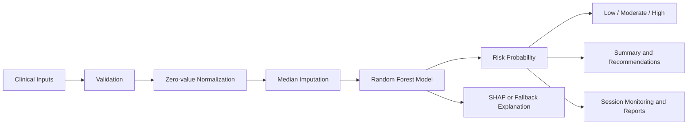

<div align="center">
  

  # GlucoSight AI

  **Explainable diabetes risk intelligence for interactive clinical decision support**

  [](https://www.python.org/)
  [](https://streamlit.io/)
  [](https://scikit-learn.org/)
  
</div>

---

## Overview

GlucoSight AI is an end-to-end machine learning web application that estimates diabetes risk from eight clinical measurements and turns the prediction into an understandable decision-support experience. The platform combines Random Forest inference with patient-level explanations, interactive what-if simulation, local clinical summaries, personalized recommendations, model benchmarking, session monitoring, and report generation.

The project demonstrates more than model training: it shows how a classical ML workflow can be packaged as a polished, modular, and user-focused healthcare AI product. All inference and rule-based narrative generation run locally, with no external API key required.

> **Portfolio summary:** An explainable AI-powered diabetes risk intelligence platform built with Streamlit and scikit-learn, featuring patient-level explanations, scenario simulation, deterministic model benchmarking, session analytics, and clinical report export.

## Key Features

- **Interactive risk assessment** using eight Pima-style clinical inputs
- **Three risk bands** with dynamic probability, confidence, and patient metrics
- **SHAP explainability** for global and patient-specific model interpretation
- **Graceful fallback explanations** when SHAP is unavailable or incompatible
- **What-if Risk Simulator** for glucose, BMI, blood pressure, insulin, and age
- **Local AI-style clinical summary** generated without transmitting patient data
- **Personalized guidance** organized by lifestyle, follow-up, monitoring, and urgency
- **Model benchmarking** across Logistic Regression, Random Forest, Gradient Boosting, and SVM
- **Session monitoring** with risk trends, category distribution, and confidence analytics
- **Assessment history** stored safely within the current Streamlit session
- **Clinical report export** as PDF, with a styled HTML fallback
- **Artifact compatibility checks** that safely retrain incompatible saved models

## Tech Stack

| Layer | Technologies |
| --- | --- |
| Application | Python, Streamlit |
| Data processing | pandas, NumPy |
| Machine learning | scikit-learn |
| Explainability | SHAP, model-contribution fallback |
| Reporting | ReportLab, HTML/CSS fallback |
| Persistence | Pickle model artifacts, JSON metadata, Streamlit session state |
| Interface | Streamlit components, custom HTML and CSS |

## Machine Learning Workflow



1. Load and validate the active diabetes dataset.
2. Treat physiologically invalid zero values as missing measurements.
3. Apply median imputation through the fitted preprocessing artifact.
4. Train or load the persisted Random Forest classifier.
5. Evaluate the active model on a deterministic stratified 80/20 split.
6. Produce probability, classification confidence, and risk category.
7. Generate global and local explanations using SHAP when available.
8. Create patient-specific guidance, monitoring records, and downloadable reports.

### Current Model Snapshot

The checked-in metadata records results on the active 768-row dataset:

| Metric | Value |
| --- | ---: |
| Accuracy | 75.97% |
| Precision | 64.91% |
| Recall | 68.52% |
| F1 score | 66.67% |
| ROC AUC | 82.46% |

These values are dataset- and split-specific evaluation results. They do not establish clinical validity or generalizability to other populations.

## Dashboard Screenshots

No dashboard screenshots are currently stored in the repository. Add exported screenshots to `docs/screenshots/` using the suggested names below.

| Product View | Placeholder |
| --- | --- |
| Patient assessment and risk result | `docs/screenshots/assessment.png` |
| Global and local explainability | `docs/screenshots/explainability.png` |
| What-if simulator and monitoring | `docs/screenshots/analytics.png` |
| Model comparison dashboard | `docs/screenshots/benchmarking.png` |
| Generated clinical report | `docs/screenshots/report.png` |

## Installation

### Prerequisites

- Python 3.8 or newer
- `pip`

### 1. Open the project directory

```bash
cd "Diabetes-Prediction-using-classical-ML 10.18.27 PM"
```

### 2. Create a virtual environment

```bash
python3 -m venv .venv
source .venv/bin/activate
```

On Windows:

```powershell
.venv\Scripts\activate
```

### 3. Install dependencies

```bash
python3 -m pip install -r requirements.txt
```

SHAP and ReportLab are optional at runtime. If either cannot load, the application keeps working through its model-contribution and HTML-report fallbacks.

## Run Locally

From the project root:

```bash
streamlit run "Machine learning model/streamlit_app_new.py"
```

Alternatively, run from the application directory:

```bash
cd "Machine learning model"
streamlit run streamlit_app_new.py
```

Streamlit will display the local dashboard URL, normally [http://localhost:8501](http://localhost:8501).

## Deployment

### Streamlit Community Cloud (Recommended)

The repository is organized for direct deployment on Streamlit Community Cloud. Both `requirements.txt` and the shared Streamlit configuration are at the repository root, avoiding installer path issues caused by the space in the application directory name.

> **Existing deployment repair:** The failed deployment log shows Python 3.14.6. Delete that Community Cloud app and create it again with Python 3.12 in Advanced settings. Community Cloud does not support changing an existing app's Python version in place.

1. Push the complete project to a GitHub repository. Confirm that the `models/`, `assets/`, `utils/`, and `data/` directories are included.
2. Sign in to [Streamlit Community Cloud](https://share.streamlit.io/) with GitHub.
3. Select **Create app**, then **Yup, I have an app**.
4. Choose the GitHub repository and branch.
5. Enter this exact entry-point path:

   ```text
   Machine learning model/streamlit_app_new.py
   ```

6. Open **Advanced settings** and choose **Python 3.12**, matching the runtime used to validate the saved model artifacts.
7. Leave the Secrets field empty. This application does not require API keys or environment variables.
8. Select **Deploy** and monitor the build logs until the app is healthy.

Community Cloud runs from the repository root and will install the root `requirements.txt` automatically. See the official [file organization](https://docs.streamlit.io/deploy/streamlit-community-cloud/deploy-your-app/file-organization), [dependency](https://docs.streamlit.io/deploy/streamlit-community-cloud/deploy-your-app/app-dependencies), and [deployment](https://docs.streamlit.io/deploy/streamlit-community-cloud/deploy-your-app/deploy) guidance.

### Optional: Render

Create a Python Web Service from the GitHub repository with:

**Build command**

```bash
pip install -r requirements.txt
```

**Start command**

```bash
streamlit run "Machine learning model/streamlit_app_new.py" --server.address 0.0.0.0 --server.port $PORT
```

No environment variables are required beyond Render's automatically supplied `PORT` value.

### Optional: Hugging Face Spaces

Hugging Face has deprecated its built-in Streamlit SDK for new Spaces. Use a **Docker Space** and run the same entry point inside a container. A Docker deployment would require a `Dockerfile` and Space metadata with `sdk: docker`; those files are intentionally not included because Streamlit Community Cloud is the primary target. See the official [Streamlit Spaces](https://huggingface.co/docs/hub/en/spaces-sdks-streamlit) and [Docker Spaces](https://huggingface.co/docs/hub/en/spaces-sdks-docker) guidance.

### Deployment Notes

- No secrets or API keys are required.
- No Debian system packages are required, so there is no `packages.txt`.
- Python is selected in Community Cloud Advanced settings, so there is no `runtime.txt`.
- Assessment history and monitoring remain session-based and are cleared when the app session ends.
- The bundled model is approximately 5.3 MB and can be committed directly to GitHub without Git LFS.

### Deployment Troubleshooting

| Error | Likely cause | Fix |
| --- | --- | --- |
| Installer parses `model/requirements.txt` as a package | A dependency file was placed inside the space-containing app directory | Keep the single `requirements.txt` at repository root and reboot the app |
| `ModuleNotFoundError` during build | Dependency file was not committed or the wrong entry point was selected | Confirm the root `requirements.txt` exists and use the exact entry-point path shown above |
| `Dataset not found` | The `data/` directory was omitted from GitHub or filename casing changed | Commit `data/diabetes.csv` with the same capitalization |
| Logo or page icon is missing | The asset directory was omitted | Commit both files in `Machine learning model/assets/` |
| Model artifact cannot be loaded | Python or scikit-learn version differs from the saved pickle | Choose Python 3.12 and keep `scikit-learn==1.4.2`; the app also probes artifacts and can retrain incompatible files |
| SHAP explanation falls back | SHAP is unavailable or incompatible at runtime | Check the dependency installation logs; prediction remains available through the built-in contribution fallback |
| Render reports no open port | The service is not using Render's assigned port | Use the exact Render start command with `--server.port $PORT` |

## Project Structure

```text
.
|-- README.md
|-- .gitignore
|-- requirements.txt              # Cloud and local Python dependencies
|-- .streamlit/
|   `-- config.toml
|-- data/
|   `-- diabetes.csv
`-- Machine learning model/
    |-- streamlit_app_new.py       # Streamlit UI and orchestration
    |-- config.yaml                # Application configuration
    |-- deploy.sh                  # Local deployment helper
    |-- assets/
    |   |-- glucosight_horizontal_logo.png
    |   `-- glucosight_logo.png
    |-- models/
    |   |-- diabetes_model.pkl
    |   |-- scaler.pkl
    |   |-- feature_names.pkl
    |   `-- model_metadata.json
    `-- utils/
        |-- explainability.py
        |-- recommendations.py
        |-- reporting.py
        |-- benchmarking.py
        `-- monitoring.py
```

## Model Inputs

| Input | Description |
| --- | --- |
| `Pregnancies` | Number of recorded pregnancies |
| `Glucose` | Plasma glucose measurement |
| `BloodPressure` | Diastolic blood pressure measurement |
| `SkinThickness` | Triceps skinfold thickness |
| `Insulin` | Serum insulin measurement |
| `BMI` | Body mass index |
| `DiabetesPedigreeFunction` | Dataset-specific family history score |
| `Age` | Patient age in years |

## Prediction Output

| Probability | Product Risk Category | Interpretation |
| --- | --- | --- |
| Below 40% | Low Risk | Lower model-estimated risk; continue appropriate routine screening |
| 40% to below 70% | Moderate Risk | Elevated model estimate; preventive follow-up may be appropriate |
| 70% and above | High Risk | Higher model estimate; prompt clinical review and diagnostic confirmation are recommended |

Risk categories describe model output only. They are not diagnostic thresholds and should always be interpreted alongside clinical history and appropriate testing.

## Example Use Cases

- Demonstrating an end-to-end healthcare ML product in a technical portfolio
- Exploring how patient measurements influence a model prediction
- Comparing classical classifiers on a shared deterministic data split
- Teaching explainability concepts using global and local feature attribution
- Exploring model sensitivity through controlled what-if scenarios
- Prototyping clinical report and monitoring workflows before production integration

The simulator demonstrates model sensitivity, not the causal effect of treatment. A simulated improvement does not guarantee a real-world health outcome.

## Future Improvements

- Add authentication, role-based access, and durable encrypted assessment storage
- Validate performance on external and more representative clinical datasets
- Add probability calibration, subgroup analysis, fairness evaluation, and drift monitoring
- Introduce clinician-reviewed recommendation rules and formal clinical governance
- Add automated tests, CI/CD, containerization, and deployment templates
- Export accessibility-reviewed visualizations and populate the screenshot gallery
- Add EHR interoperability only after privacy, security, and regulatory review

## Clinical Disclaimer

**GlucoSight AI is an educational and research project.** It is not a medical device, does not provide medical advice, and must not be used as a substitute for professional diagnosis, treatment, or clinical judgment. Model predictions may be incorrect and require confirmation through appropriate diagnostic testing and evaluation by a qualified healthcare professional.

Do not enter protected health information unless the application has undergone the required privacy, security, and deployment review.

## Author

**Samiksha**

Machine Learning and AI portfolio project focused on explainable healthcare decision-support systems.

---

<div align="center">
  Built with Streamlit, scikit-learn, and a product-first approach to explainable AI.
</div>
