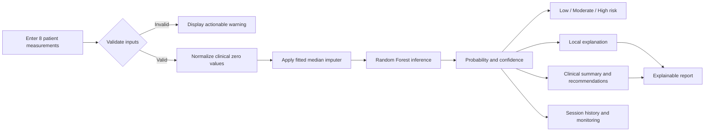
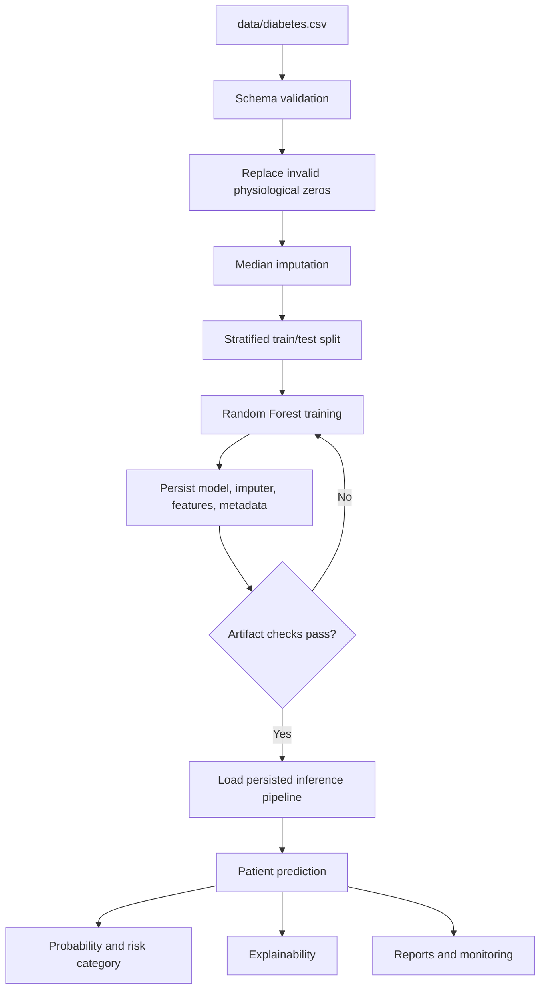
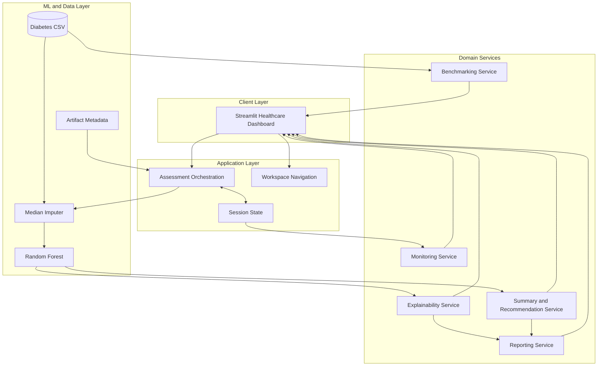
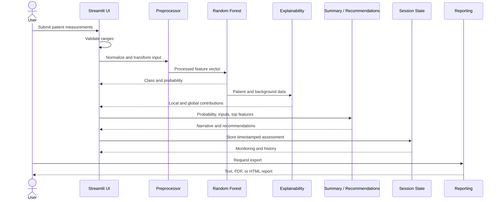

<div align="center">
  

  # GlucoSight AI

  ### Explainable diabetes risk intelligence, designed as a complete clinical decision-support experience

  <p>
    GlucoSight AI transforms eight patient measurements into an interpretable risk assessment,
    patient-specific explanation, local clinical narrative, scenario simulation, and exportable report.
  </p>

  [](https://glucosight-ai.streamlit.app/)
  [](https://www.python.org/)
  [](https://streamlit.io/)
  [](https://scikit-learn.org/)
  [](#explainable-ai)
  [](#deployment)
  [](#license)

  [**Launch the application**](https://glucosight-ai.streamlit.app/) ·
  [**Explore features**](#product-capabilities) ·
  [**Run locally**](#quick-start) ·
  [**Review architecture**](#system-architecture)
</div>

---

## Product Overview

GlucoSight AI is an end-to-end machine learning product for diabetes risk assessment and educational clinical decision support. It combines a persisted Random Forest model with a modern Streamlit interface and a set of modular services for explainability, simulation, monitoring, recommendations, benchmarking, and report generation.

The application is intentionally broader than a prediction form. A submitted assessment becomes a structured product workflow:

1. Validate and normalize eight clinical measurements.
2. Estimate diabetes probability with the active model.
3. Translate probability into an understandable risk band.
4. Explain the prediction globally and at the patient level.
5. Generate a professional local clinical narrative and categorized guidance.
6. Explore model sensitivity through a what-if simulator.
7. Monitor session-level assessment behavior.
8. Export the result as a text summary, PDF, or styled HTML report.

All inference and narrative generation run locally. The application does not require an external AI API or transmit assessment data to a third-party language model.

> **Important:** GlucoSight AI is an educational and research project. It is not a medical device and its output is not a diagnosis.

## Why This Project Matters

Many machine learning portfolios stop after reporting a score. GlucoSight AI demonstrates the engineering work required to turn a model into a usable, explainable, and deployable product.

| Product concern | How GlucoSight AI addresses it |
| --- | --- |
| **Trust** | Shows patient-level feature direction and global feature importance instead of returning an unexplained label |
| **Actionability** | Converts model output into structured lifestyle, follow-up, monitoring, and urgency guidance |
| **Exploration** | Provides a controlled what-if simulator for understanding model sensitivity |
| **Reliability** | Fingerprints the dataset, versions model artifacts, probes persisted objects, and retrains stale or incompatible artifacts |
| **Evaluation** | Recomputes hold-out metrics and compares four classical classifiers on the same deterministic split |
| **Operational visibility** | Tracks assessment volume, average risk, confidence, category distribution, and recent trends per session |
| **Communication** | Produces recruiter-ready UI views and patient-readable report exports |
| **Deployment safety** | Uses relative resource paths, a root dependency manifest, cloud configuration, and Python 3.14 wheel-backed dependencies |

### Business Value

- Demonstrates how explainable ML can support clearer conversations around risk factors.
- Shows how a single model can be wrapped in monitoring, reporting, and scenario-analysis workflows.
- Provides a foundation for future clinician review, audit logging, authentication, and longitudinal monitoring.
- Presents complex ML output in a format accessible to technical and non-technical stakeholders.

### Technical Value

- Separates UI orchestration from explainability, recommendations, benchmarking, monitoring, and reporting services.
- Handles optional dependencies and incompatible serialized models without taking down inference.
- Uses deterministic validation and cached benchmarking to keep comparisons reproducible and reruns responsive.
- Supports local execution and Streamlit Community Cloud from the same codebase.

## Product Capabilities

| Area | Capability | Implementation |
| --- | --- | --- |
| **Assessment** | Eight-field patient risk assessment | Validated Streamlit form with bounded clinical inputs |
| **Prediction** | Probability, class, confidence, and risk category | Random Forest `predict_proba` with Low/Moderate/High bands |
| **Patient context** | Age, BMI, blood pressure, and glucose interpretation | Dynamic metric cards generated from the latest submitted values |
| **Explainability** | Patient-specific local feature attribution | SHAP when available; dependency-safe model-contribution fallback |
| **Global insight** | Dataset-level feature importance | Mean absolute SHAP impact or estimator importance fallback |
| **Simulation** | Current versus simulated risk | Reuses the production preprocessing and prediction pipeline |
| **Clinical narrative** | Professional AI-style summary | Deterministic local text generator; no API key required |
| **Recommendations** | Lifestyle, follow-up, monitoring, and urgency | Rule-based guidance using probability, glucose, BMI, blood pressure, and age |
| **Benchmarking** | Comparison of four classical models | Logistic Regression, Random Forest, Gradient Boosting, and SVM |
| **Monitoring** | Session-level operational analytics | Assessment count, average risk, confidence, trends, and category mix |
| **History** | Timestamped assessment records | Streamlit session state with generated assessment IDs |
| **Reporting** | Text, PDF, and HTML reports | ReportLab PDF with styled HTML fallback |
| **Deployment** | Cloud-ready startup and artifact migration | Streamlit config, pinned dependencies, relative paths, version-aware retraining |

## Application Experience

The dashboard is organized into six connected workspaces:

| Workspace | Purpose |
| --- | --- |
| **Insights & Explainability** | Explains why the latest patient received the current probability and shows global model importance |
| **Analytics** | Displays the risk gauge, feature rankings, confidence, session monitoring, and what-if simulator |
| **Recommendations** | Presents the local clinical summary and four categories of personalized guidance |
| **Model Insights** | Shows ROC performance, dataset metadata, model metrics, and cached classifier benchmarking |
| **History** | Lists assessments created during the current browser session |
| **Documentation** | Summarizes model, dataset, input, and clinical-use information inside the product |

### Patient Assessment Workflow



### Risk Output

| Model probability | Product category | Product interpretation |
| ---: | --- | --- |
| `< 40%` | **Low Risk** | Lower model-estimated risk; continue appropriate routine screening |
| `40% to < 70%` | **Moderate Risk** | Elevated model estimate; preventive follow-up may be appropriate |
| `>= 70%` | **High Risk** | Higher model estimate; prompt clinical review and diagnostic confirmation are recommended |

These bands organize model output for the application. They are not diagnostic criteria.

## Dashboard Screenshots

Screenshots have not yet been committed. The following gallery is intentionally ready for real product captures without using mock images.

### Assessment and Risk Overview

<!-- Add dashboard screenshot here: docs/screenshots/assessment-overview.png -->

> **Placeholder:** Patient assessment form, generated risk hero, probability ring, and clinical metric cards.

### Explainability Workspace

<!-- Add dashboard screenshot here: docs/screenshots/explainability.png -->

> **Placeholder:** Local patient attribution and global feature-importance views.

### Analytics and What-if Simulation

<!-- Add dashboard screenshot here: docs/screenshots/analytics-simulator.png -->

> **Placeholder:** Session monitoring, recent risk trend, category distribution, confidence distribution, and simulator output.

### Model Benchmark and Report

<!-- Add dashboard screenshot here: docs/screenshots/model-benchmark.png -->

> **Placeholder:** Deterministic model comparison and exported clinical report preview.

## Machine Learning System

### Dataset

The repository includes a Pima-style diabetes dataset with:

| Property | Value |
| --- | ---: |
| Records | 768 |
| Input features | 8 |
| Negative class | 500 |
| Positive class | 268 |
| Target | `Outcome` |
| Hold-out strategy | Stratified 80/20 split |
| Random state | 42 |

The application computes a SHA-256 fingerprint of the active dataset. Saved artifacts are accepted only when the fingerprint, file size, and scikit-learn version match the runtime expectations.

### Model Inputs

<details>
<summary><strong>Expand the complete input reference</strong></summary>

| Feature | UI range | Unit / meaning | Processing note |
| --- | ---: | --- | --- |
| `Pregnancies` | 0–20 | Number of recorded pregnancies | Passed as a numeric model feature |
| `Glucose` | 0–600 | mg/dL | Zero is treated as missing and normalized |
| `BloodPressure` | 0–200 | mmHg, diastolic | Zero is treated as missing and normalized |
| `SkinThickness` | 0–100 | mm, triceps skinfold | Zero is treated as missing and normalized |
| `Insulin` | 0–1000 | µU/mL | Zero is treated as missing and normalized |
| `BMI` | 0–100 | kg/m² | Zero is treated as missing and normalized |
| `DiabetesPedigreeFunction` | 0–3 | Dataset-specific family-history score | Passed as a continuous feature |
| `Age` | 0–150 | Years | Passed as an integer-valued feature |

The interface accepts broad ranges to prevent UI failure, but unusual values trigger validation warnings. Clinical plausibility must still be reviewed by a qualified professional.

</details>

### Training and Inference Pipeline



The production estimator uses 500 trees, balanced class weighting, `min_samples_leaf=3`, and deterministic random state 42. Model training is triggered only when required artifacts are missing, the dataset changes, or the scikit-learn artifact version differs from the runtime.

## Model Performance and Evaluation

The checked-in metadata records the following deterministic hold-out results for the active Random Forest artifact:

| Metric | Hold-out result | What it communicates |
| --- | ---: | --- |
| Accuracy | **75.97%** | Overall fraction of correct hold-out classifications |
| Precision | **64.91%** | Proportion of predicted positives that were positive |
| Recall | **68.52%** | Proportion of positive hold-out cases identified |
| F1 score | **66.67%** | Balance between precision and recall |
| ROC AUC | **82.46%** | Ranking performance across classification thresholds |
| Brier score | **0.1620** | Mean squared error of predicted probabilities; lower is better |

These metrics describe one dataset and one deterministic hold-out split. They do not demonstrate clinical validity, fairness across populations, prospective performance, or external generalization.

### Runtime Model Benchmark

The Model Insights workspace trains and compares four classifiers using the same stratified split:

- Logistic Regression
- Random Forest
- Gradient Boosting
- Support Vector Machine

Accuracy, Precision, Recall, F1, and ROC AUC are calculated at runtime and cached by dataset fingerprint. The README intentionally does not hard-code benchmark results because they should reflect the active dependency stack and dataset.

<details>
<summary><strong>Evaluation design notes</strong></summary>

- The split is stratified to preserve class proportions.
- `random_state=42` keeps comparisons reproducible.
- Each benchmark model owns its appropriate imputation and scaling pipeline.
- Zero-division behavior is handled explicitly for classification metrics.
- Benchmarking is decision support for model selection, not evidence of clinical readiness.
- No cross-validation confidence intervals are currently reported.

</details>

## Explainable AI

GlucoSight AI provides two levels of interpretability:

### Local Explanation

For the latest assessment, the app ranks each feature by its contribution and labels the direction as either increasing or reducing estimated risk. Values are presented with patient-relevant units where available.

### Global Explanation

The dashboard aggregates absolute explanation magnitude across a background sample to show which features have the greatest overall influence on the active model.

### Dependency-safe Fallback

- **Supported SHAP runtime:** Uses `TreeExplainer` for the Random Forest and computes local and global SHAP values.
- **Unavailable or incompatible SHAP:** Uses model feature importance combined with the patient’s normalized distance from dataset medians.
- **Python 3.14 deployment:** Uses the fallback because SHAP’s `numba` dependency does not currently provide a compatible wheel.

The fallback is an approximation, not a mathematically equivalent replacement for SHAP. Both views explain model behavior rather than biological causality.

## What-if Risk Simulator

The Analytics workspace allows users to adjust:

- Glucose
- BMI
- Blood pressure
- Insulin
- Age

The simulator reuses the exact preprocessing object and prediction function used by the main assessment. It compares current and simulated probabilities and classifies the change as improved, worsened, or approximately unchanged.

> The simulator measures model sensitivity to changed inputs. It does not estimate treatment effect, causal impact, or a guaranteed future health outcome.

## Clinical Summary and Recommendations

The local narrative generator produces professional clinical language without an external API. It combines:

- Model probability and risk category
- Classification confidence
- Leading feature directions
- Glucose, BMI, blood pressure, and age thresholds
- Educational-use disclaimer

Recommendations are separated into four operational categories:

| Category | Focus |
| --- | --- |
| **Lifestyle** | Weight, activity, nutrition quality, and sustainable risk reduction |
| **Clinical follow-up** | Screening, confirmatory testing, and clinician review |
| **Monitoring** | Glucose, blood pressure, BMI, and age-aware follow-up |
| **Urgency** | Risk-dependent timing and symptom-aware escalation language |

Rules are deterministic and inspectable. They do not prescribe treatment.

## Analytics and Model Monitoring

Monitoring is session-scoped and includes:

| Metric | Description |
| --- | --- |
| Assessment count | Number of predictions generated in the active session |
| Average predicted risk | Mean diabetes probability across session assessments |
| Average confidence | Mean winning-class probability |
| Risk distribution | Counts of Low, Moderate, and High results |
| Recent risk trend | Last ten probability values in chronological order |
| Confidence distribution | Assessment counts across confidence bands |

Session monitoring is useful for demonstrating operational analytics without storing patient records. It is not persistent monitoring or production drift detection.

## Patient Reports

Every completed assessment can be exported with:

- Assessment identifier
- Active model name
- Patient inputs
- Risk probability and category
- Classification confidence
- Top contributing features and direction
- Local clinical summary
- Categorized recommendations
- Medical-use disclaimer

ReportLab generates a PDF when available. If PDF support is unavailable, the app returns a styled standalone HTML report. A plain-text clinical summary is also available from the top action bar.

## System Architecture



## Data Flow



## Repository Structure

```text
.
|-- README.md
|-- requirements.txt
|-- .gitignore
|-- .streamlit/
|   `-- config.toml
|-- data/
|   `-- diabetes.csv
`-- Machine learning model/
    |-- streamlit_app_new.py           # UI, model lifecycle, orchestration
    |-- config.yaml                    # Application configuration reference
    |-- deploy.sh                      # Local deployment helper
    |-- assets/
    |   |-- glucosight_horizontal_logo.png
    |   `-- glucosight_logo.png
    |-- models/
    |   |-- diabetes_model.pkl         # Persisted Random Forest
    |   |-- scaler.pkl                 # Persisted median imputer
    |   |-- feature_names.pkl          # Ordered inference schema
    |   `-- model_metadata.json        # Fingerprint, version, metrics, statistics
    `-- utils/
        |-- __init__.py
        |-- explainability.py          # SHAP and fallback attribution
        |-- recommendations.py         # Local narrative and guidance
        |-- reporting.py               # Text, HTML, and PDF generation
        |-- benchmarking.py            # Deterministic classifier comparison
        `-- monitoring.py              # Session analytics
```

## Technology Stack

| Layer | Technology | Role |
| --- | --- | --- |
| Language | Python | Application, modeling, analytics, and reporting |
| Web framework | Streamlit | Reactive dashboard and session lifecycle |
| Data | pandas, NumPy | Tabular manipulation and numerical processing |
| Machine learning | scikit-learn | Preprocessing, Random Forest, metrics, and benchmarking |
| Explainability | SHAP | Tree-based local and global attribution where supported |
| Reporting | ReportLab | Native PDF generation |
| Presentation | HTML, CSS, SVG, Mermaid | Branded UI, gauges, diagrams, and reports |
| Persistence | Pickle, JSON | Model artifacts and reproducibility metadata |
| Deployment | Streamlit Community Cloud | Hosted application runtime |

## Quick Start

### Prerequisites

- Python 3.11 or newer
- `pip`
- Git, if cloning from GitHub

### 1. Clone the repository

```bash
git clone https://github.com/Sam-wan30/GlucoSight-AI.git
cd GlucoSight-AI
```

### 2. Create an isolated environment

```bash
python3 -m venv .venv
source .venv/bin/activate
```

Windows PowerShell:

```powershell
.venv\Scripts\Activate.ps1
```

### 3. Install dependencies

```bash
python3 -m pip install --upgrade pip
python3 -m pip install -r requirements.txt
```

### 4. Run from the repository root

```bash
streamlit run "Machine learning model/streamlit_app_new.py"
```

The default local URL is [http://localhost:8501](http://localhost:8501).

<details>
<summary><strong>Alternative launch from the application directory</strong></summary>

```bash
cd "Machine learning model"
streamlit run streamlit_app_new.py
```

Application resources are resolved relative to the script, so both launch forms are supported.

</details>

## Usage Walkthrough

1. Open **Patient Assessment** and review the eight default values.
2. Enter a patient profile using the stated measurement units.
3. Select **Generate AI Assessment**.
4. Review the probability, risk band, confidence, and patient metric cards.
5. Open **Insights & Explainability** to inspect local and global drivers.
6. Open **Analytics** to review session monitoring and run a what-if scenario.
7. Open **Recommendations** for the local narrative and categorized guidance.
8. Open **Model Insights** to review validation and benchmark results.
9. Open **History** to inspect assessments from the current session.
10. Download the clinical summary or export the PDF/HTML report.

## Deployment

### Streamlit Community Cloud

The project is deployed at [glucosight-ai.streamlit.app](https://glucosight-ai.streamlit.app/).

To deploy a fork:

1. Push the full repository to GitHub.
2. Open [Streamlit Community Cloud](https://share.streamlit.io/).
3. Choose **Create app** and select the repository and branch.
4. Use this exact entry point:

   ```text
   Machine learning model/streamlit_app_new.py
   ```

5. Deploy without secrets; no API key is required.

The root `requirements.txt` is pinned to a Python 3.14-compatible wheel stack. On first startup with a newer scikit-learn runtime, the app detects the older bundled artifact and retrains it from the committed dataset before inference.

### Render

<details>
<summary><strong>Render Web Service configuration</strong></summary>

**Build command**

```bash
pip install -r requirements.txt
```

**Start command**

```bash
streamlit run "Machine learning model/streamlit_app_new.py" \
  --server.address 0.0.0.0 \
  --server.port $PORT
```

</details>

### Hugging Face Spaces

New Streamlit Spaces require the Docker SDK. A future Hugging Face deployment should add a minimal Dockerfile, expose the configured Space port, and retain the same entry point. Docker files are intentionally not included because Streamlit Community Cloud is the maintained deployment target.

## Engineering Challenges Solved

| Challenge | Engineering response |
| --- | --- |
| Serialized scikit-learn models can break across versions | Store the training library version, reject mismatches before unpickling, and retrain safely |
| Dataset changes can silently invalidate artifacts | Compare SHA-256 and byte-size metadata before loading |
| SHAP may be missing or unsupported on a deployment runtime | Wrap explainability behind a stable interface with a model-based fallback |
| Repeated benchmark training slows reactive reruns | Cache results using the active dataset fingerprint |
| Physiological zero values distort inference | Normalize known invalid-zero columns and reuse the fitted median imputer |
| Reports must work without optional PDF libraries | Generate styled HTML when ReportLab is unavailable |
| UI reruns can lose workflow state | Store the latest result, history, and simulation in Streamlit session state |
| Cloud entry points and assets live in a directory with spaces | Resolve files from `Path(__file__)` and keep dependencies at repository root |
| Python 3.14 lacks a compatible `numba` wheel | Install SHAP only on supported runtimes and use the tested fallback on Cloud |

## Recruiter and Resume Highlights

### What This Repository Demonstrates

- End-to-end ownership from data preprocessing and modeling to UX, deployment, and documentation.
- Practical explainable-AI design with transparent degradation when optional tooling is unavailable.
- Reproducible evaluation and apples-to-apples benchmarking across classical classifiers.
- Product thinking through simulation, monitoring, narrative generation, and report workflows.
- Production-aware artifact lifecycle management, dependency pinning, and clean-clone deployment.
- Clear communication of medical limitations and responsible-use boundaries.

### Resume-ready Bullet

> Built and deployed **GlucoSight AI**, an explainable diabetes risk intelligence platform using Streamlit and scikit-learn, integrating patient-level attribution, interactive risk simulation, deterministic four-model benchmarking, session monitoring, local clinical narrative generation, and PDF/HTML reporting with version-aware model retraining and dependency-safe fallbacks.

## Limitations

- The dataset is small and does not represent all populations or clinical environments.
- Metrics come from one deterministic hold-out split; no external or prospective validation is included.
- Risk bands are application-level presentation categories, not diagnostic thresholds.
- Local recommendations are deterministic educational rules and are not clinician-authored treatment plans.
- The what-if simulator is associative model analysis, not causal inference.
- Session history and monitoring are ephemeral and are not an audit trail or patient record system.
- No authentication, authorization, encryption-at-rest workflow, EHR integration, or durable database is implemented.
- No formal fairness, calibration, subgroup, or drift study is currently included.
- The deployed Python 3.14 environment uses the explainability fallback until SHAP's transitive dependencies support that runtime.

## Medical Disclaimer

**GlucoSight AI is provided strictly for educational, research, and portfolio demonstration purposes.** It is not a medical device, does not provide medical advice, and must not be used to diagnose, treat, prevent, or manage diabetes or any other condition.

Predictions can be incorrect. Abnormal measurements and elevated model probabilities require appropriate diagnostic testing and evaluation by a qualified healthcare professional. Do not enter protected health information unless the application has undergone the required privacy, security, legal, and deployment review.

## Roadmap

- [ ] Add repeated cross-validation and confidence intervals
- [ ] Add probability calibration and calibration plots
- [ ] Add subgroup performance and fairness analysis
- [ ] Validate against an external, more representative dataset
- [ ] Add authenticated, encrypted, durable assessment storage
- [ ] Add structured audit logging and model/data lineage
- [ ] Add persistent drift and data-quality monitoring
- [ ] Add clinician-reviewed guidance rules and governance documentation
- [ ] Add automated unit, integration, and visual regression tests
- [ ] Add CI/CD, containerization, and infrastructure templates
- [ ] Add accessibility review and real dashboard screenshots
- [ ] Explore standards-based EHR interoperability after security review

## Contributing

Thoughtful contributions are welcome, especially around testing, accessibility, calibration, fairness analysis, documentation, and responsible clinical-AI design.

1. Fork the repository.
2. Create a focused branch:

   ```bash
   git checkout -b feature/concise-description
   ```

3. Keep changes scoped and preserve the existing prediction workflow.
4. Run a syntax and application smoke test:

   ```bash
   python3 -m py_compile "Machine learning model/streamlit_app_new.py" "Machine learning model/utils/"*.py
   streamlit run "Machine learning model/streamlit_app_new.py"
   ```

5. Document behavioral changes and open a pull request.

For clinical recommendations, diagnostic interpretation, security controls, or patient-data handling, include authoritative references and clearly describe the intended safety boundary.

## License

No open-source license file is currently included in this repository. Copyright remains with the project author, and reuse or redistribution is not automatically granted. Add an explicit `LICENSE` file before presenting the project as open source or accepting substantial external contributions.

## Author

**Samiksha V. Wanjari**<br />
Machine Learning and AI portfolio project focused on explainable healthcare decision-support products.

[GitHub: @Sam-wan30](https://github.com/Sam-wan30)

---

<div align="center">
  <strong>GlucoSight AI</strong><br />
  From probability to explanation, exploration, monitoring, and communication.
</div>
